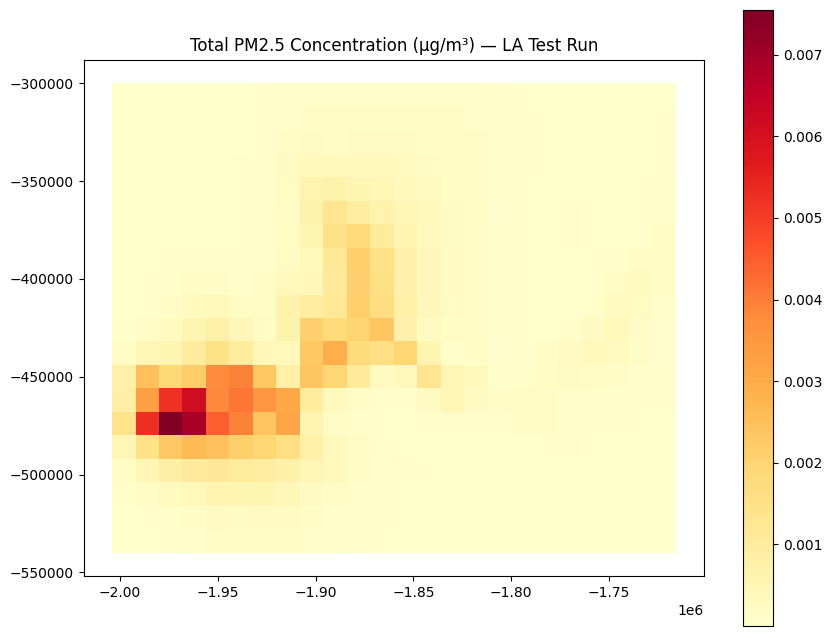

# InMAP-PAVITRA

PAVITRA-InMAP is a fork of the open-source [InMAP](https://github.com/spatialmodel/inmap) air pollution model, being adapted by IIT Bombay together with UC Berkeley, the University of Washington, and CSTEP to support air quality modeling for India. This document records an initial beta test of the model engine itself, to confirm the build-and-run pipeline works correctly ahead of region-specific data being added.

## Running the Model

1. Install [Go](https://go.dev/dl/) (1.11+) and [Git](https://git-scm.com/).
2. Clone the repo and build the binary:
   ```bash
   git clone https://github.com/INMAP-PAVITRA/InMAP-PAVITRA.git
   cd InMAP-PAVITRA
   GO111MODULE=on go build ./cmd/inmap
   ```
3. Download evaluation data — the full dataset (`evaldata_v1.6.1.zip`) is on [Zenodo](https://zenodo.org/records/3403934). For a much lighter test, use the `la_test/` subset bundled inside that same zip.
4. Edit a `.toml` config file so its paths point to your data, and so the `[VarGrid]` settings (origin, cell size, nesting) match the metadata of the `.ncf` file you're using.
5. Run:
   ```bash
   ./inmap run steady --config=yourconfig.toml
   ```
6. View the output shapefile in QGIS, or load it directly in Python with `geopandas` to plot it.

Running locally needs a lot of RAM for full-scale data. [Google Colab](https://colab.research.google.com/) is a more reliable place to test, since it gives a clean 12GB+ environment with nothing else competing for memory.

## What We Did

- Tried running the full-scale evaluation dataset, both on a local machine and on Colab's free tier — it consistently ran out of memory, either while loading the large national emissions shapefiles or while initializing the model grid.
- Switched to the `la_test` subset included in the same evaluation data: a small, pre-built Los Angeles-area dataset meant for quick functional tests.
- Fixed a series of config mismatches along the way: wrong data filenames, mismatched shapefile field names (`AllCause` vs `allcause`), and a grid origin/extent that didn't match the actual `.ncf` file's geography.
- Got a complete steady-state simulation to run end-to-end on Colab, converging within a few minutes.

## Result


*(Add your generated heatmap image to the repo — e.g. `images/la_test_heatmap.png` — and update the path above to match.)*

The map shows estimated total PM2.5 concentration across the LA test grid. There's a clear pollution hotspot near the single test emission source, fading outward with distance — the expected pattern for a point source, and a good sign that the model and pipeline are producing physically sensible output. The emissions input here is a placeholder test file, not real-world data, so the absolute numbers don't represent actual air quality.

## Limitations & Challenges

- **Memory**: a full national-scale run needs significantly more RAM (likely 32–64GB+) than a typical laptop or Colab's free tier (12–16GB) provides — this was the main blocker throughout.
- **No India-specific data yet**: this repo currently only contains the original upstream evaluation dataset; the README itself still has unresolved Git merge markers from the upstream project, confirming India-specific data and config haven't been merged in yet.
- **Upload reliability**: uploading multi-GB data through a browser into Colab failed repeatedly with no clear error; downloading directly from the source (Zenodo, via `wget`) was far more reliable.
- **Exact-match requirements**: shapefile field names and grid geometry have to match the underlying `.ncf` metadata precisely, and this differs between the full dataset and the `la_test` subset.
- **Not representative of India/Bangladesh**: this test validates the software pipeline only. A separate dataset (e.g. Global InMAP's data, or India/Bangladesh-specific inputs) would be needed for a result that's actually meaningful for the project's region of interest.
